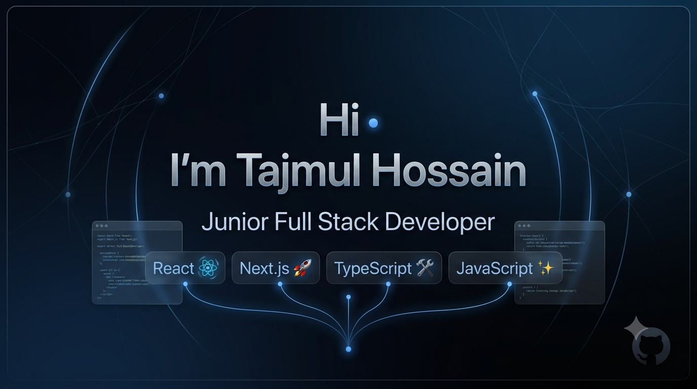

  

<h1 align="center">Hi, I'm Tajmul Hossain 👋</h1>
<h3 align="center">Junior Full Stack Developer (MERN | Next.js)</h3>

<h3 align="left">I'm a passionate Full Stack Developer who enjoys building modern, responsive, and user-friendly web applications with the MERN stack and Next.js. I focus on writing clean, maintainable code and shipping complete, production-style projects — from auth and payments to admin dashboards. Currently preparing for Full Stack / Front-End Developer opportunities.</h3>

  

  

### 🚀 Featured Projects

- **[RecipeHub](#)** — Full-stack recipe platform with Stripe payments (premium membership + per-recipe purchase), Better Auth, admin dashboard, and imgbb image uploads. `Next.js · Express · MongoDB · Stripe`
- **[HireLoop](#)** — Job-seeking platform with plan-based job posting limits, dashboard layouts, and a dark violet/navy design system. `Next.js · Express · MongoDB · HeroUI v3`
- **[SportNest](#)** — Sports facility booking platform with Google OAuth, JWKS token verification, and facility search/CRUD. `Next.js · Express · MongoDB · Better Auth`

> Replace the `#` links above with your live demo / GitHub repo links for each project.

### 🌱 Currently Learning
- TypeScript
- Data Structures & Algorithms
- Advanced Next.js
- Backend Architecture

### 📫 Reach Me

<h3 align="left">Connect with me:</h3>

<h3 align="left">Languages and Tools:</h3>

&nbsp;

